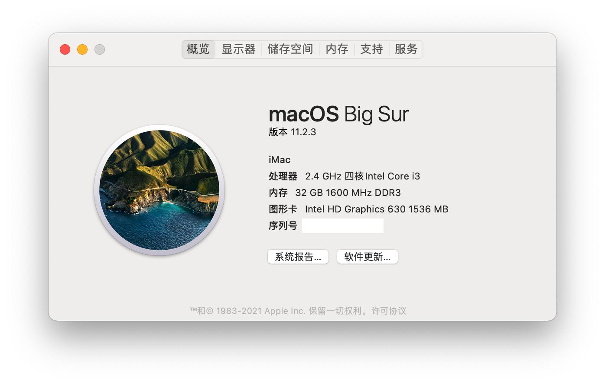
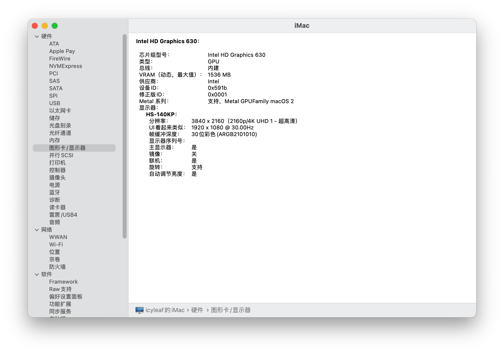
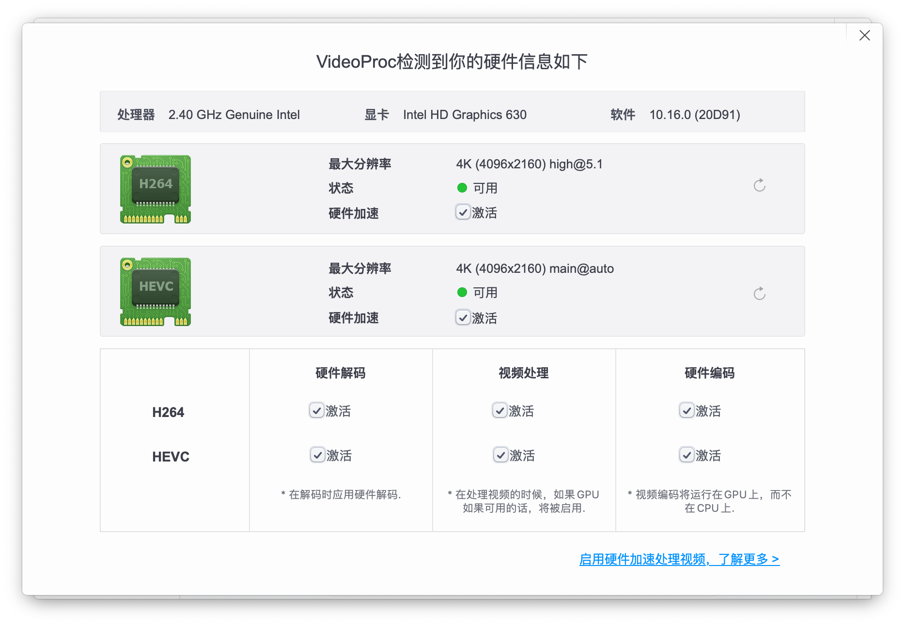
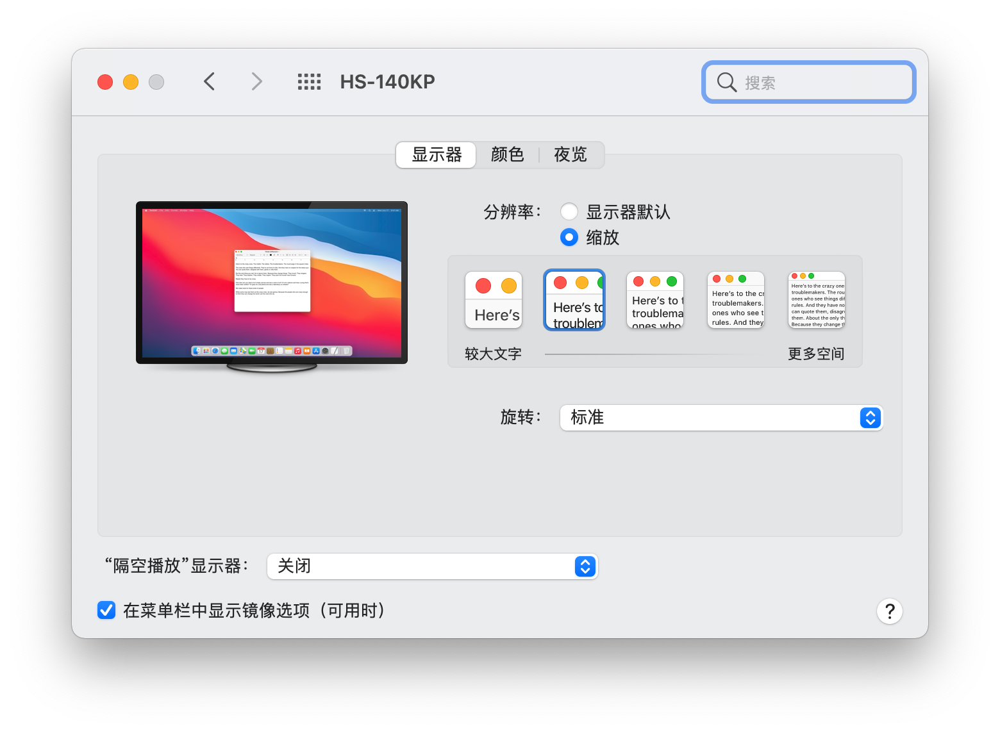
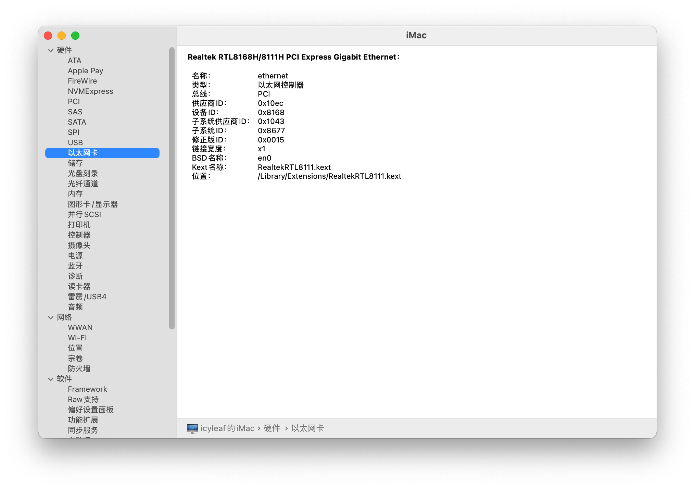
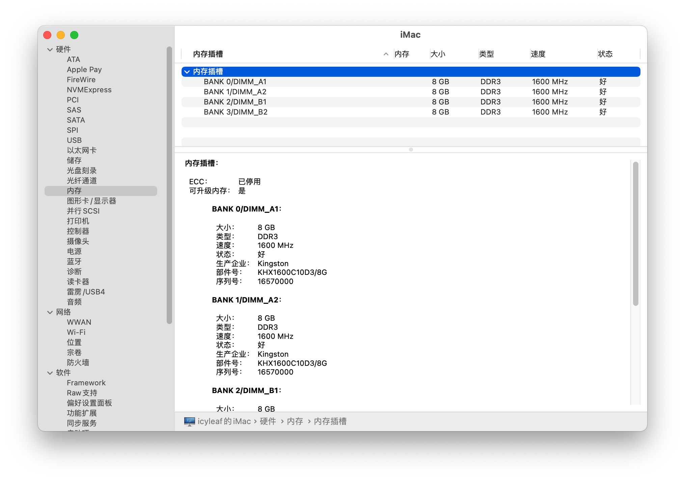

# 垃圾佬的 QL3X macOS 11 Big Sur EFI

## 装机清单

| 名称 | 品牌型号 | 备注 |
| --- | --- | --- |
| CPU | ql3x 笔记本 i7 7820HK ES 魔改版 | 超频全核 4.0G |
| 主板 | 华硕 B150M A D3 M-ATX 23.4x20.1cm | 已刷魔改 BIOS |
| 散热器 | AVC 杂牌铜底散热器 | 70mm 高，咸鱼购入全新 |
| 内存 | 金士顿 DDR3 1600 8G x 4 |  |
| 硬盘 | 镁光 CT500MX 500G | |
| 显卡 | 核显 UHD630 | 可仿冒 HD530 或 HD630 |
| 无线网卡/蓝牙 | 博通 BCM94360CS2 | PCIE 转接板（购买中） |
| 电源 | 银欣 ST30SF 300W SFX | 不超频 |
| 机箱 | 酷酷的小机箱 毁灭者K | M-ITX 机箱 |
| 显示器 | NV140QUM-N61 背板 15.6 4k 便携显示器 | Mini-HDMI 接入 |

## 兼容情况

- [x] ME 版本
    - [x] 刷 11.8.65.3590 并关闭 me
- [x] macOS 版本
    - [x] 11.0
- [x] 显卡
    - [x] 仿核显 HD630
      - [x] HEVC 硬解
      - 主板接口
        - [x] HDMI - 最高 4k 30帧
        - [ ] DVI - 进入系统黑屏不显示
        - [ ] VGA - 没有测试
    - [x] 仿核显 HD530
      - [ ] HEVC 硬解
      - 主板接口
        - [x] HDMI
        - [x] DVI - 最高 1080p 60帧
        - [ ] VGA - 没有测试
- [x] 声卡 (Realtek ALC887)
    - [x] 主板后置
    - [x] HDMI 声音输出
- [ ] 有线网卡 (Realtek RTL8111H)
- [ ] 无线 WiFi
- [ ] 蓝牙
    - [ ] Handoff
    - [ ] Airdrop
- [ ] 睡眠唤醒 - me 关闭问题核显**可能解决不了**唤醒问题
- [ ] 所有 USB 插口

## 配置备注

### CPU

ql3x 其原身是 Intel 笔记本七代 i7 7820HK ES 版 CPU，默频全核睿频 3.3 不锁倍频，具体参数如下：

- 核心：4c8t
- 工艺：14nm+
- 架构：Kaby Lake
- 基础频率：2.9Ghz
- 加速频率：3.9Ghz
- 三级缓存：8MB
- 核显：UHD 630
- TDP：45w

### BIOS

> 待补充

### EFI

> 待补充

## 成果截图

## 感谢

- [简单聊聊1151魔改CPU——以QL3X为例（2020.9.3重新修订）](http://www.smxdiy.com/thread-2867-1-1.html)
- [QL3X一些注意事项](https://blog.lovemadoka.xyz:444/18.html)
- [QL3X 如何解决 小毛病 内存 pcie2.0 黑苹果me问题 小白项 比较啰嗦看看就好](https://www.bilibili.com/read/cv7443903/)
- [OpenCore Desktop Kaby Lake EFI Guide](https://dortania.github.io/OpenCore-Install-Guide/config.plist/kaby-lake.html)
- [ql3x EFI](https://github.com/xueziQQ/desktop_soyo_maxsun_h110_ql3x_ql2x_opencore_efi)
- [ql2x EFI](https://github.com/Road-tech/Hackintosh_Asus-H110s1_QL2X_DW1820A_OC)