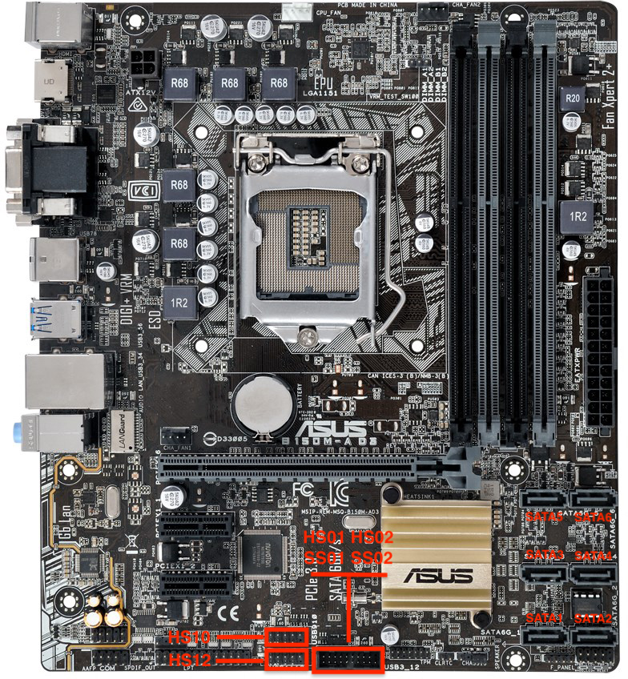
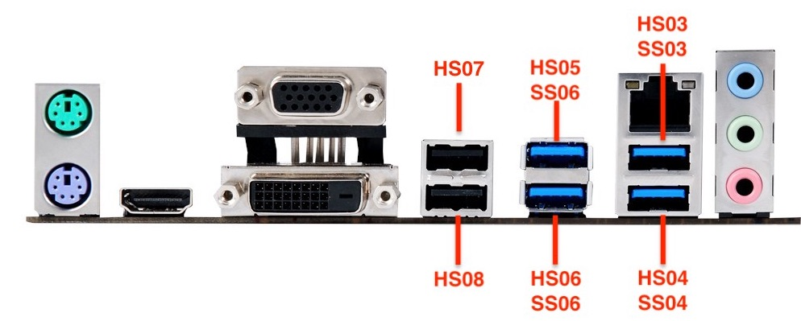
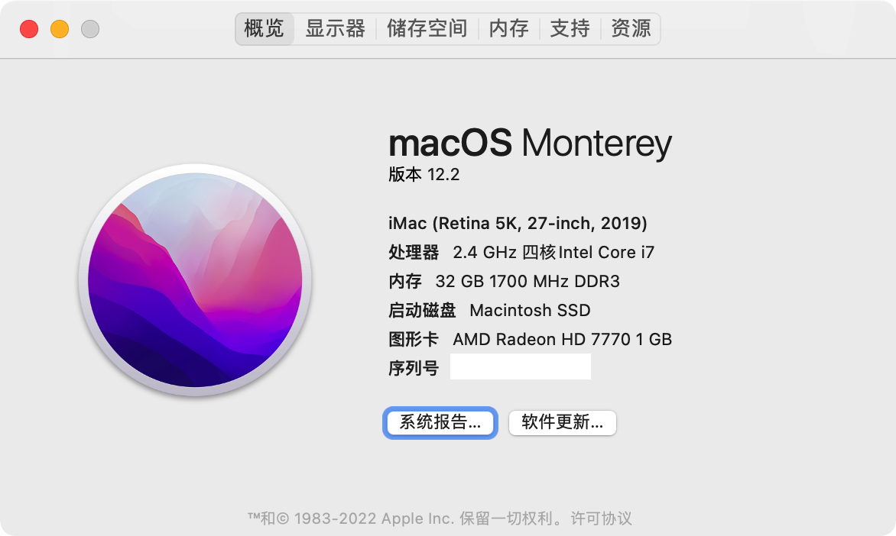
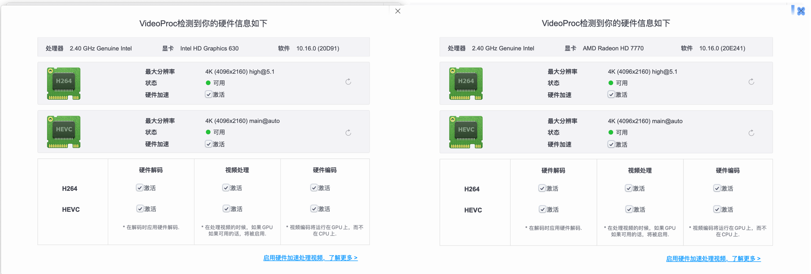
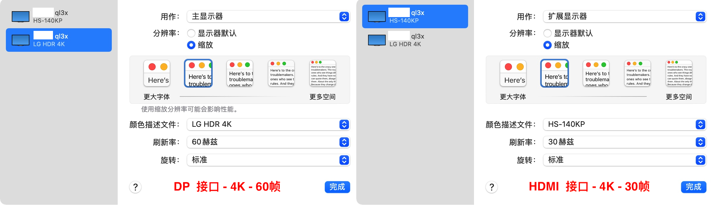
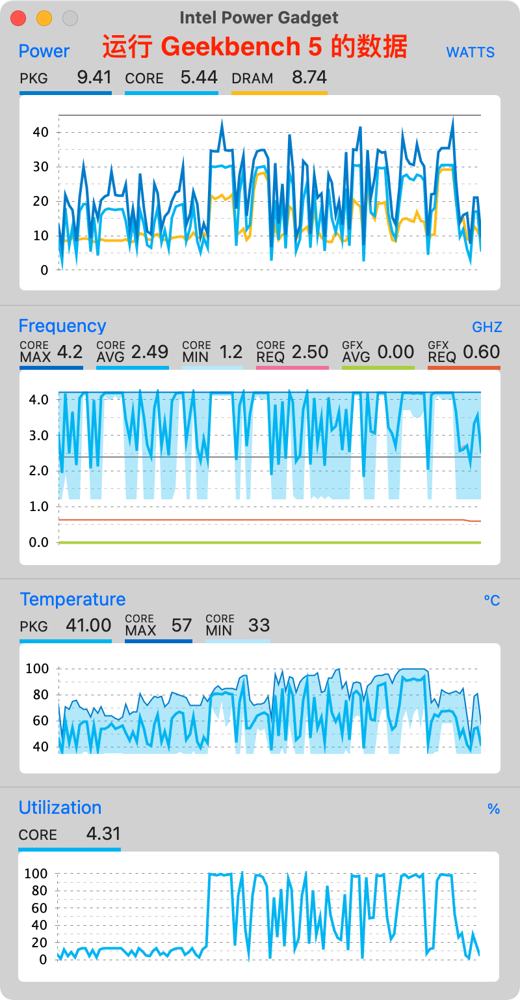

# 垃圾佬的 QL3X macOS 11 Big Sur EFI

## 装机清单

| 名称 | 品牌型号 | 备注 |
| --- | --- | --- |
| CPU | ql3x 笔记本 i7 7820HK ES 魔改版 | 超频全核 4.1G |
| 主板 | 华硕 B150M A D3 M-ATX 23.4x20.1cm | 已刷魔改 BIOS |
| 散热器 | ID-COOLING FROSTFLOW 120 水冷 | 咸鱼二手 60 元 |
| 内存 | 金士顿 HyperX DDR3 1600 8G x 4 | 单通道 4k 显示器可能会闪屏 |
| 硬盘 | 致钛 SC001 Active 512GB | MX500 磁盘挂了，返修中 |
| 显卡 | 蓝宝石 HD 7770 1G | 咸鱼二手 168 元 |
| 无线网卡/蓝牙 | 博通 BCM94360CS2 | PCIE 转接板 |
| 电源 | 银欣 ST30SF 300W SFX | |
| 机箱 | 酷酷的小机箱 毁灭者K | M-ITX 机箱 |
| 显示器 | LG 27UL500-W 4k 显示器<br />NV140QUM-N61 背板 15.6 4k 便携显示器 | DP + Mini-HDMI |

## 兼容情况

### 完美
- [x] ME 版本
    - [x] 刷 11.8.65.3590 并关闭 me
- [x] macOS 版本
    - [x] 11.0
- [x] 显卡
    - [x] HD 7770
      - [x] HEVC 硬解
      - 主板接口
        - [x] DP - 最高 4k 60帧
        - [x] HDMI - 最高 4k 30帧
        - [x] DVI - 4k 30帧（分辨率有些奇怪，画面模糊的厉害）
    - [x] 核显 HD630
      - [x] HEVC 硬解
      - 主板接口
        - [x] HDMI - 最高 4k 30帧
    - [x] 仿核显 HD530
      - 主板接口
        - [x] HDMI
        - [x] DVI - 最高 1080p 60帧
- [x] 声卡 (Realtek ALC887)
    - [x] 主板后置
    - [x] HDMI 声音输出
- [ ] 有线网卡 (Realtek RTL8111H) - 没有网线测试
- [x] 无线 WiFi
- [x] 蓝牙
    - [x] Handoff
    - [x] Airdrop
- [x] 所有 USB 插口


### 不兼容（核显）

- 睡眠唤醒 - me 关闭问题核显**解决不了**，有强需要请独显
- 显卡
  - 核显 HD630
    - 主板接口
      - DVI - 可进 BIOS 但进入系统黑屏不显示
      - VGA - 系统不支持，不用想了
  - 仿核显 HD530
    - 无法开启 HEVC 硬解
    - 主板接口
      - VGA - 系统不支持，不用想了

## 配置备注

### CPU

ql3x 其原身是 Intel 笔记本七代 [i7 7820HK](https://ark.intel.com/content/www/us/en/ark/products/97464/intel-core-i7-7820hk-processor-8m-cache-up-to-3-90-ghz.html) ES 版 CPU，默频全核睿频 3.3 不锁倍频，具体参数如下：

- 核心：4c8t
- 工艺：14nm+
- 架构：Kaby Lake
- 基础频率：2.9Ghz
- 加速频率：3.9Ghz
- 三级缓存：8MB
- 核显：HD 630
- TDP：45w

### BIOS

- Ai Tweaker - 超频（**具体看 CPU 体质**）
  - CPU Core Ratio - Sync All Cores
    - 1-Core Ratio Limit - 41
  - CPU Core/Cache Voltage - Manual Mode
    - CPU Core Voltage Override - 1.2
- Advanced
  - CPU Configuratgion
    - Hyper-threading - Enabled (**不需要跑虚拟化的可以不开**）
    - CPU Power Management Cofiguration
      - CFG lock - Disabled
  - System Agent (SA) Configuration
    - VT-d - Disabled
    - Graphics Configuration
      - Primary Display - Auto (如果加独显也需要用于开启核显硬件加速)
      - iGPU Multi-Monitor - Enabled (多显示器开启；如果加独显也需要用于开启核显硬件加速)
      - DVMT Pre-Allocated - 64M 或 128M (4k显示器)
  - Boot
    - Fast Boot - Disabled
    - CSM
      - Launch CSM - Disabled - (经测试可以不用管)
    - Secure Boot
      - OS Type - Other OS
      - Key Management - (经测试可以不用管)
        - 手动删除所有的 keys 就会 Disabled Secure Boot

### USB 接口

接口如下，USB 端口注入 HS01-06、HS10、HS12，SS01-06 = 14 个端口，其中 HS01-06 改为 USB2，HS10 和 HS12 改为 Internal，关闭 HS07-09，HS11 和 SS07-12。





### 核显睡眠唤醒问题

由于关闭 me 的问题核显暂时无法解决睡眠唤醒，只能先通过[官方文档](https://dortania.github.io/OpenCore-Post-Install/universal/sleep.html)提供方式禁止睡眠：

```bash
sudo pmset autopoweroff 0
sudo pmset powernap 0
sudo pmset standby 0
sudo pmset proximitywake 0
sudo pmset tcpkeepalive 0
```

## 成果截图








## 感谢

- [简单聊聊1151魔改CPU——以QL3X为例（2020.9.3重新修订）](http://www.smxdiy.com/thread-2867-1-1.html)
- [QL3X一些注意事项](https://blog.lovemadoka.xyz:444/18.html)
- [QL3X 如何解决 小毛病 内存 pcie2.0 黑苹果me问题 小白项 比较啰嗦看看就好](https://www.bilibili.com/read/cv7443903/)
- [OpenCore Desktop Kaby Lake EFI Guide](https://dortania.github.io/OpenCore-Install-Guide/config.plist/kaby-lake.html)
- [ql3x EFI](https://github.com/xueziQQ/desktop_soyo_maxsun_h110_ql3x_ql2x_opencore_efi)
- [ql2x EFI](https://github.com/Road-tech/Hackintosh_Asus-H110s1_QL2X_DW1820A_OC)

## 我的其他 EFI

- [ASRock 华擎 Z390 Phantom Gaming itx/ac + RX580](https://github.com/icyleaf/EFI-ASRock-Z390-Phantom-Gaming-ITX)
